## 코드 리뷰

코드 리뷰는 다른 사람이 작성한 코드를 검토하며 궁금한 부분에 대해 질문을 하거나, 버그가 있는 부분을 알려주거나, 더 효율적으로 개선할 수 있는 부분을 찾아 피드백을 주며 서로의 코드를 개선해나가는 과정을 말합니다.

다른 사람이 내 코드를 보고 피드백을 준다는 것이 마치 숙제 검사처럼 느껴지기도 하고 괜스레 부끄럽게 느껴질지도 모르지만 너무 무서워하지 않으셔도 됩니다. 코드 리뷰는 누가 잘했고 잘못했고를 따지는 과정이 아니니까요. 그저 서로의 코드를 조금 더 좋게 만들 수 있는지 보는 과정일 뿐입니다.

코드 리뷰에는 많은 장점이 있지만 몇 가지 장점을 꼽자면 아래와 같습니다.

**버그와 장애의 사전 예방**

다른 사람이 내 코드를 보는 시각과 내 코드를 내가 보는 시각은 분명 다릅니다. 이를 이용해 내가 놓친 실수들을 빠르게 바로잡을 수 있습니다. 이를 통해 버그와 장애를 프로덕션 환경에 배포되기 전에 예방할 수 있습니다.

**코딩 스타일 통일**

개발자들마다 다양한 코딩 스타일이 있습니다. 하지만 다양한 코딩 스타일이 섞이게 되면 가독성은 낮아지고 유지 보수하기 어려워집니다. 코드 리뷰를 통해 팀이나 회사에서 공통으로 사용하는 코딩 스타일을 유지할 수 있으며 일관된 코딩 스타일은 유지 보수를 쉽게 만들며 문서화에도 큰 도움이 됩니다.

**지식의 공유**

개발에도 경험을 통해야만 알 수 있는 지식들이 있습니다. 이런 지식들은 블로그 같은 매체를 통해 종종 공개되기도 하나 대부분은 그렇지 않습니다. 코드 리뷰는 그런 지식들을 배울 수 있는 좋은 매개체입니다.

**코드 품질 향상**

'좋은 코드'라는 것은 사람과 때에 따라 기준이 조금씩 달라지지만 내 코드를 동료에게 보여주고 피드백을 받는 것은 스스로 코드를 작성할 때 '좋은 코드'에 대해 한 번 더 생각하게 만드는 계기가 됩니다. 반복적인 코드 리뷰는 결과적으로 나와 동료의 코드 품질이 향상되는 결과를 가져옵니다.

이 외에도 더 많은 장점이 있지만 장점을 늘어놓은 글을 읽는 것보다 직접 경험해보는게 훨씬 좋습니다. 이제 코드 리뷰를 어떻게 하는지 알아봅시다.

## 프로젝트 저장소를 로컬에 복사하기

먼저 작업하려는 프로젝트의 GitHub 저장소 페이지에 가서 프로젝트의 Git 저장소 주소를 복사합니다. GitHub 계정에 ssh 키를 등록했다면 ssh 주소를, 아니라면 https 주소를 복사합니다.

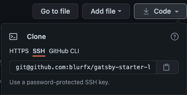

그 다음 `git clone` 명령어를 이용하여 로컬에 프로젝트를 복사합니다.

```bash
git clone 프로젝트_저장소_주소

# 예시
# git clone https://github.com/blurfx/gatsby-starter-lavender.git
```

그 다음 프로젝트 폴더로 이동합니다.

```bash
cd 프로젝트 이름

# 예시
# cd gatsby-starter-lavender
```

## Git 브랜치 만들어 작업하기

왜 브랜치를 나누어 작업을 해야할까요? 한 프로젝트에 참여하는 사람들은 모두 다른 일을 합니다. 누군가는 새로운 기능을 만들고, 또 다른 누군가는 버그를 고칩니다. 이렇게 사람들이 각자 작업을 하는데, 내가 수정하는 부분이 다른 사람이 작업하는 부분과 겹쳐 갑자기 바뀌어 있다면, 꽤 당황스러울겁니다. 그래서 각자의 작업을 할 때 서로의 영향을 받지 않고 독립적으로 작업할 수 있도록 브랜치를 사용하는 것입니다.

브랜치는 나중에 다른 브랜치에 병합(Merge)하여 작업을 모을 수 있습니다. 아래는 로그인과 회원가입 기능 구현을 별도의 브랜치에서 작업을 한 뒤 main 브랜치에 합친 모습입니다. 이렇게 되면 로그인과 회원가입을 구현하는 두 사람은 서로의 영향을 받지 않고 편하게 작업할 할 수 있을겁니다.

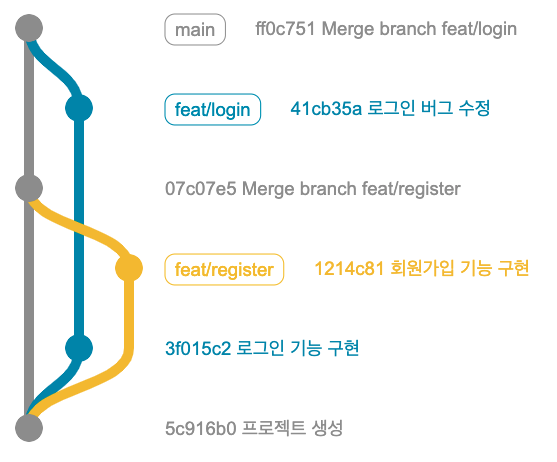

먼저 자신이 어느 브랜치에 있는지 확인합니다.  이름 앞에 *표시가 붙은 브랜치가 현재 브랜치입니다.

```bash
git branch

# 출력 예시
#
# *develop
#  main
```

만약 다른 브랜치에 있다면 `git switch` 명령어로 다른 브랜치로 이동할 수 있습니다.

```bash
$ git switch main
```

현재 브랜치를 기반으로 새로운 브랜치를 만들고 싶다면 아래와 같이 하면 됩니다. 이제 새로운 브랜치에서 자유롭게 코딩하시면 됩니다! 🎉

```bash
git switch -c 새_브랜치_이름
```

브랜치 이름을 짓는 방식은 자유입니다. [Git-flow](https://techblog.woowahan.com/2553/) 방식을 따르기도 하고 JIRA와 같은 이슈 트래커의 이슈 티켓 ID를 사용하기도 합니다. 브랜치 이름을 짓는 규칙은 회사, 팀, 사람마다 다르니 자유롭게 정해보세요.

## Pull Request 만들기

작업을 다 끝내고 커밋과 푸쉬까지 끝내셨나요? 이제 리뷰를 받을 시간입니다!

Pull Request를 만드는 방법은 여러가지가 있습니다. 처음 브랜치를 푸쉬할때 나오는 링크를 따라가셔도 되고,

```bash
git push --set-upstream origin feat/login

Total 4 (delta 1), reused 0 (delta 0), pack-reused 0
remote: Resolving deltas: 100% (1/1), completed with 1 local object.
remote:
remote: Create a pull request for 'feat/login' on GitHub by visiting:
remote:      https://github.com/username/sample-app/pull/new/feat/login
remote:                 # 위의 url이 pull request를 만드는 링크입니다.
```

푸쉬를 한 뒤 GitHub 프로젝트 저장소에 들어가면 나오는 알림을 따라가셔도 되고,

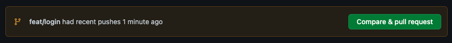

혹은 직접 GitHub 프로젝트 저장소의 `Pull Request` 탭에 들어가 `New pull request` 버튼을 누르셔도 됩니다.

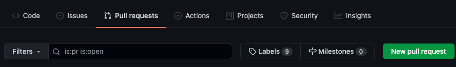

먼저 합칠 브랜치를 설정해주세요. 아래와 같은 모습이라면 `feat/login` 브랜치가 `develop` 브랜치로 합쳐진다는 것입니다. 바로 합쳐지는 것은 아니니 안심하세요.

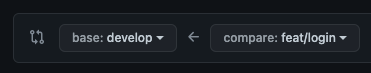

브랜치를 확인한 뒤 `Create pull request` 버튼을 클릭합니다.

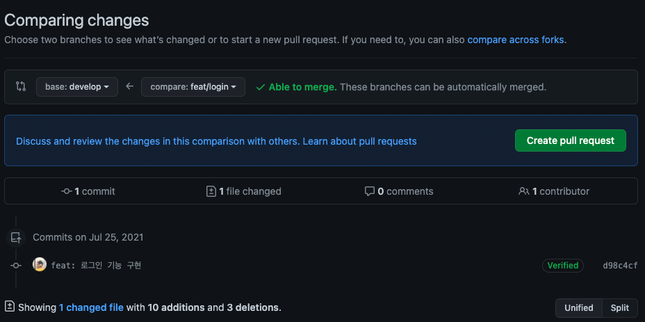

아직 끝나지 않았습니다. 이제 리뷰를 받기 위해 내가 한 작업에 대해 적을 시간입니다. 제목은 내가 한 작업을 간략히 요약해서 적고 내용에는 작업한 내용과 중점적으로 확인 받았으면 하는 부분 등을 상세하게 적습니다.

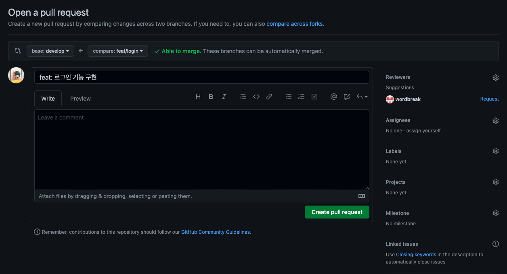

어떤 내용을 적어야 할지 모르겠다면 아래와 같은 예시를 보고 비슷하게 작성해보세요.

```markdown
## 작업 개요
- 회원 가입 페이지 구현

## 상세 내용

기존에 만들어진 Input, Button, Checkbox 컴포넌트를 이용해서 회원 가입 페이지를 구현했습니다.

- 기존 Input 컴포넌트를 Composition 해서 회원 가입 폼에 쓸 컴포넌트를 만들었는데 이렇게 해도 되는걸까요?
- 지금 폼의 상태 관리 로직을 개선할 방법이 있을까요?
```

우측에 있는 `Reviewers`를 클릭하고 리뷰를 요청할 사람들을 선택합니다. 마지막으로 `Create pull request` 버튼을 클릭하면 Pull Request가 만들어집니다.

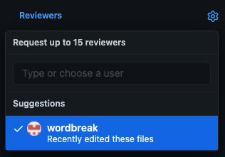

## 코드 리뷰 하기

리뷰 요청을 받았다면 해당 Pull Request내의 `Files changed` 탭에 들어가 리뷰를 시작할 수 있습니다.

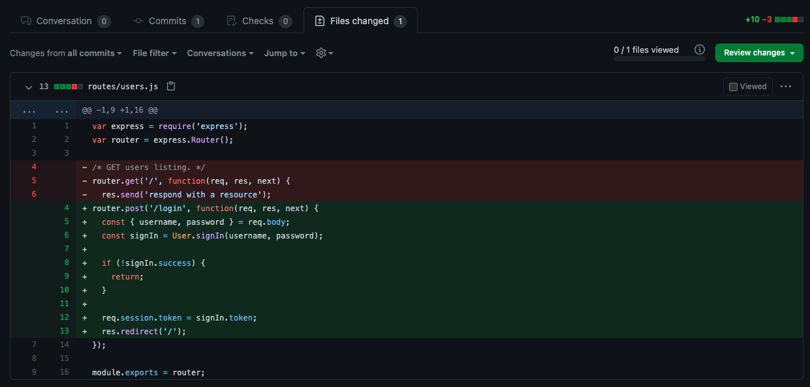

코드 줄의 맨 앞 공간을 클릭하면 아래와 같이 해당 줄에 의견을 남길 수 있습니다.

`Add single comment` 를 클릭하면 바로 의견이 남겨집니다.

`Start a review` 를 클릭하면 작성자에게 보이지 않는 임시 등록 상태가 되고 나중에 리뷰를 완료하면 작성한 의견들이 한번에 등록됩니다.

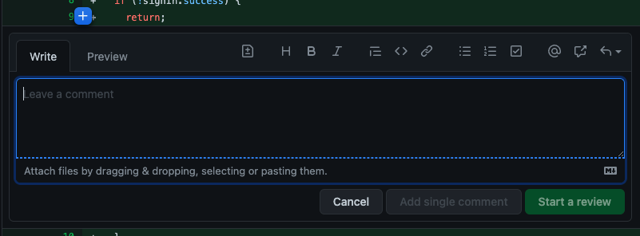

앞에서 했던 것처럼 클릭하는 대신 드래그를 하면 여러 줄에 대한 의견도 남길 수 있습니다.

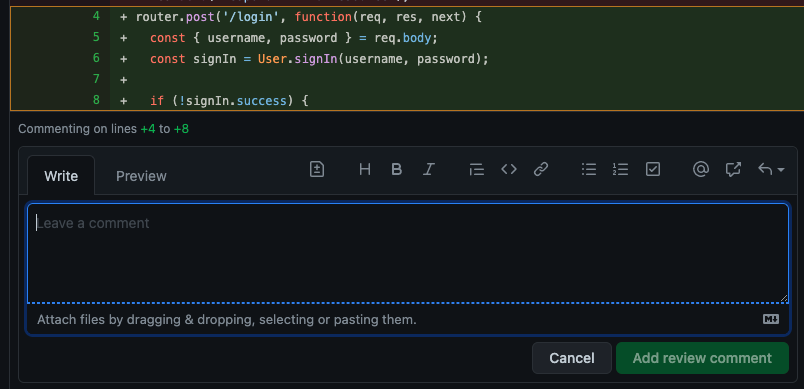

의견을 다 남겼다면 우측 상단의 `Finish your review` 버튼을 클릭하여 리뷰를 끝마칠 수 있습니다. 여기서는 리뷰를 끝냈다는 코멘트를 남기거나, 고생했다는 말을 합니다. 물론 코드에 대한 얘기를 더 해도 됩니다.

마지막으로 일반적인 피드백을 주는 `Comment` , 이제 합쳐도 괜찮을 것 같다는 `Approve` , 확실하게 코드를 수정하고 넘어가야 하는 경우에는 `Request changes`를 선택하고 `Submit review`를 클릭하시면 됩니다.

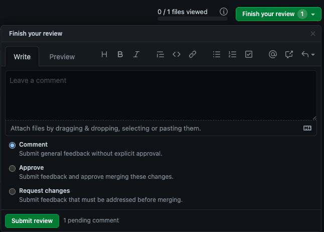

## 코드 리뷰 반영하기

코드 리뷰를 받으면 Pull Request 페이지에서 아래와 같은 식으로 리뷰들이 남겨집니다. 여기서 더 대화를 하면서 개선 방향을 찾아 나가거나 바로 의견을 수렴하여 코드를 수정해도 됩니다.

반영된 부분은 `Resolve conversation` 을 클릭하여 처리 완료됨을 표시해 주면 좋습니다.

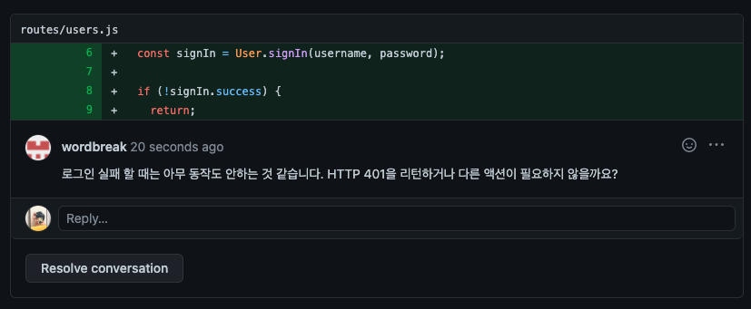

리뷰를 마친 뒤에 코드가 더 수정되었다면 리뷰어에게 다시 리뷰를 요청할 수 있습니다.

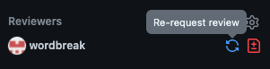

리뷰어가 Pull Request를 승인하고 병합이 가능한 시점이 온다면 `Merge pull request` 혹은 그 옆의 화살표를 클릭하고 `Squash` 나 `Rebase` 등의 방식으로 브랜치 병합이 가능합니다. 여기까지가 한 번의 코드 리뷰 사이클입니다. 고생하셨습니다!

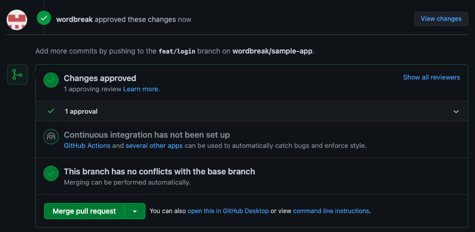

## 본격적으로 코드 리뷰를 하기 전에 — 작업은 잘게 나눕시다

코드 리뷰는 코드를 작성한 사람이 아닌 다른 사람이 하게 되므로 최대한 잘게 나누어 컨텍스트에 대한 이해가 충분하지 않아도 리뷰를 할 수 있어야 합니다.

작업이 커지면 그만큼 작업하는 부분도 많아지게 되고 수많은 파일과 코드의 변경 사항이 생기게 되는데 수십 개의 파일의 변경 사항을 검토하는 것은 오래 걸리고 힘든 일입니다. 5개의 파일이 바뀐 코드 리뷰를 10번 하는 것과 50개의 파일이 바뀐 코드 리뷰를 1번 하는 것은 완전히 다른 일인 것처럼요.

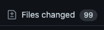
*99개의 파일을 다 보는건 힘든일이죠*

또한 작성한 코드에 문제가 있더라도 작은 변경사항이 담긴 커밋은 Revert 하기 더 쉽습니다. 정말 작성한 부분만 이전 상태로 바꾸면 되기 때문이죠. 만약 큰 변경사항이 담긴 커밋에 포함된 코드가 문제를 일으켰다면 Revert 하기에는 조금 까다로울 겁니다. 다른 멀쩡한 기능들까지 영향을 받을 테니까요.

또한 코드 리뷰를 반영하는 데에도 도움이 됩니다. 만약 인증이란 큰 단위로 회원가입, 로그인, 회원 탈퇴, 비밀번호 찾기를 모두 한 번에 구현하고 코드 리뷰를 받았는데 구현에 접근한 방법이 잘못되었다면? 모두 다 고쳐야 할 겁니다. 대신에 회원 가입 기능만 구현했다면 회원 가입 API에 관한 구현만 수정하고 다시 리뷰를 받으면 되겠죠.

그러니 가능하다면 작업은 최대한 잘게 나누어 작업합시다.

## 마치며

이 글을 시작할 때 말했듯이 코드 리뷰는 숙제 검사가 아닌 좋은 제품을 만들기 위해 버그는 없는지, 서로의 코드를 더 개선할 수 있는지 확인하는 과정일 뿐입니다. 그런데 인간의 심리라는 것이 내가 작성한 코드에 대한 지적이 들어오면 기분이 나빠지고, 마음이 상하고, 나의 논리가 틀리지 않았다는 것을 증명하기 위해 방어적인 자세로 나올 때도 있습니다. 하지만 나 자신과 나의 코드는 엄연히 다른 존재입니다. 처음에는 쉽지 않겠지만 나와 코드를 동일시하지 않게 될수록 이성적으로 코드에 대한 지적을 받기 쉬워질 겁니다.

오픈 소스 활동을 하다 보면 이슈나 코드 리뷰에서 남을 무시하는 듯한 말투로 말을 하는 사람이 종종 보입니다. 그러지 맙시다. 저는 개인적으로 팀의 성장은 좋은 커뮤니케이션에서 나온다고 생각합니다. 동료에게 이걸 왜 모르냐는 듯이 거들먹거리거나 왜 코드를 이딴 식으로 작성했냐고 하는 등 독성 말투를 사용하지 맙시다. 내 기분이 나쁘다고 동료의 기분까지 망치지 말고, 자신의 실수에는 관대하고 타인의 실수에는 엄격한 사람이 되지 맙시다.

코드 리뷰라는 행위에 맞춰 리뷰를 할 때는 꼼꼼하게 확인해 주고 친절하게 개선 방향을 알려주고, 리뷰를 요청할 때는 궁금한 부분들은 모두 물어봅시다.

만약 코드 리뷰를 통과한 코드가 버그를 만들고 장애를 일으켰다면 코드를 작성한 사람을 비난하지 맙시다. 코드 리뷰에서 제대로 걸러내지 못한 모두의 책임입니다.

코드 리뷰를 하면서 모두가 함께 성장했으면 좋겠습니다.

감사합니다.
