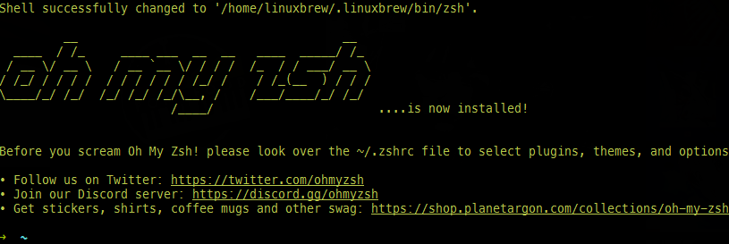
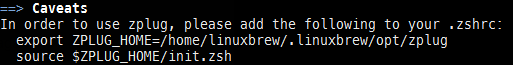

회사 개발자분의 터미널 환경 설정을 도와드리면서 내 [dotfiles](https://github.com/blurfx/dotfiles) 레포지터리에 올려놓은 터미널 설정들을 공유드렸는데 이번 기회에 다른 사람들도 보고 따라 할 수 있도록 터미널 설정하는 과정을 글로 작성해본다.

> macOS 기준으로 작성했으며 Ubuntu 20.04에서도 아래의 과정을 통해 터미널 설정을 해보았습니다.

# Homebrew

`Homebrew`는 맥과 리눅스에서 동작하는 패키지 매니저다. 보통 리눅스에서는 `apt`, `snap`, `yum` 같이 리눅스 배포판 개발자가 만들어놓은 패키지 매니저들이 따로 있지만 맥은 공식 패키지 매니저가 따로 없기 떄문에 Homebrew를 사용한다.

[brew.sh](https://brew.sh/)에 접속하거나 아래에 있는 설치 스크립트를 복사해서 설치를 하면 된다.

```bash
/bin/bash -c "$(curl -fsSL https://raw.githubusercontent.com/Homebrew/install/HEAD/install.sh)"
```

설치가 완료되면 `Next steps`라는 메시지가 나오는데 아래의 `Add Homebrew to your PATH in ...` 단계에서 안내해 주는 명령어를 실행하면 설치가 된다. 이 단계에서 하는 일은 Homebrew에서 사용할 환경 변수를 설정하고 `PATH` 환경 변수에 Homebrew 바이너리가 위치한 디렉터리를 추가하여 터미널에서 Homebrew를 사용할 수 있게 해주는 것이다.

이후 Homebrew가 안내해 주는 대로 `gcc`도 먼저 설치하자.

```
brew install gcc
```


# Zsh

macOS 10.15 Catalina부터는 기본적으로 zsh가 설치되어 있지만, 다른 리눅스 배포판의 경우 대부분의 `bash`를 기본으로 사용할 것이다.

나는 zsh를 사용하므로 `zsh --version` 명령어로 터미널에서 zsh가 설치되어 있는지 확인 후 설치되어 있지 않다면 zsh를 설치한다.

```bash
brew install zsh
```

이후 기본 쉘을 zsh로 변경한다.
```
chsh -s $(which zsh)
```
만약 기본 쉘을 변경하는데 올바르지 않은 쉘이라고 나온다면 

## oh-my-zsh
[oh-my-zsh](https://github.com/ohmyzsh/ohmyzsh)는 zsh의 설정을 관리해 주는 프레임워크다. 

여러 좋은 플러그인과 이쁜 기본 테마를 제공해서 많은 사람들이 사용한다. oh-my-zsh 레포지터리의 [Basic Installation](https://github.com/ohmyzsh/ohmyzsh#basic-installation) 섹션을 확인하거나, 아래에 있는 명령어를 통해 oh-my-zsh를 설치한다.

```bash
sh -c "$(curl -fsSL https://raw.githubusercontent.com/ohmyzsh/ohmyzsh/master/tools/install.sh)"
```

설치가 완료되면 아래와 같은 이쁜 터미널로 변신한다.



## Zplug

Zplug는 Zsh의 플러그인 관리자다. Homebrew를 통해 설치하거나 [직접 설치](https://github.com/zplug/zplug#installation)할 수 있다.

```
brew install zplug
```

설치가 완료되면 아래와 같은 문구가 나온다. 아래 두 줄을 `.zshrc`에 추가해 주자.



그리고 `.zshrc` 맨 밑에 아래 스크립트를 추가하자. 앞으로 터미널이 실행될 때 zplug를 통해 추가한 플러그인을 자동으로 감지하고 설치 여부를 사용자에게 물어보는 스크립트다.

```bash
if ! zplug check --verbose; then
    printf "Install? [y/N]: "
    if read -q; then
        echo; zplug install
    fi
fi
zplug load
```

## Powerlevel10k

oh-my-zsh가 기본적으로 제공하는 테마도 이쁘고 그중 `agnoster` 테마가 인기가 많지만, 나는 `Powerlevel10k`라는 별도의 테마를 설치해서 사용한다.

어떻게 생긴 테마인지는 [레포지터리](https://github.com/romkatv/powerlevel10k)에서 직접 확인하자.

이 테마는 테마에 맞게 커스텀 된 폰트를 사용할 것을 권장하는데 [여기](https://github.com/romkatv/powerlevel10k#meslo-nerd-font-patched-for-powerlevel10k)에서 해당 폰트를 내려받고 설치하여 터미널에 적용하면 된다.

Powerlevel10k는 여러 설치 방법을 제공하는데 여기서는 Zplug를 사용하여 설치할 것이다. `.zshrc` 파일을 열어 아래의 명령어를 아래와 같이 적당한 곳에 넣어주자.
```bash
source $ZPLUG_HOME/init.zsh
# ...

zplug romkatv/powerlevel10k, as:theme, depth:1 ## << Powerlevel10k

# ...
if ! zplug check --verbose; then
# ...
```

이후 `source ~/.zshrc` 명령어를 입력하거나 터미널을 재시작하면 Powerlevel10k 테마를 설정하는 단계가 시작된다.


## Zsh Plugins

내가 사용하는 Zsh Plugin은 아래와 같다.

- [zsh-autosuggestions](https://github.com/zsh-users/zsh-autosuggestions) — 이전에 사용한 명령어를 토대로 추천하는 명령어를 보여주고, 자동완성도 해준다.
  
  

  + 공식 설치 가이드에는 Zplug를 사용한 방법이 나와있지 않지만. 아래처럼 설치할 수 있다.
    
    `zplug "zsh-users/zsh-autosuggestions"`
  
- [zsh-syntax-highlighting](https://github.com/zsh-users/zsh-syntax-highlighting) — 터미널에서 사용하는 명령어에 구문 강조를 해준다. 뛰어나진 않지만, 그래도 없는 것보다는 낫다.
  + Before
    
    
  + After
    
    

# fzf

증분 검색으로 터미널에서 명령어 히스토리나 파일, 폴더 등을 빠르게 검색할 수 있게 해주는 툴이다. 예전에는 [percol](https://github.com/mooz/percol)을 사용했었는데 계속 사용하다 보니 fzf가 훨씬 빠르고 사용하기 쉽다는 느낌을 많이 받았다.

[레포지터리](https://github.com/junegunn/fzf)에 적혀있는 설치 가이드를 따라 하면 되는데 여기서 추가로 Key binding은 꼭 설치하는 것이 좋다. 명령어 히스토리나 파일, 폴더 검색을 `Ctrl + R`과 `Ctrl + T`로 검색할 수 있게 해주는데 이게 정말 편하다.


# Vim

나는 터미널 텍스트 에디터인 Vim을 자주 사용하는데, Vim에서 사용하는 플러그인들을 소개한다.

## vim-plug
Vim의 플러그인 매니저 중 하나인 [vim-plug](https://github.com/junegunn/vim-plug)를 설치한다. (Vundle이나 Pathogen 같은 다른 플러그인 매니저도 있다)

이후 `.vimrc`에 플러그인을 불러오는 부분을 추가하고 저 사이에 플러그인들을 추가 해주면 된다.
```vim
call plug#begin('~/.vim/plugged')

# Plugins goes here

call plug#end()
```

플러그인을 추가하고 나서 Vim의 일반 모드에서 `:PlugInstall`을 입력하면 플러그인을 설치한다.

## Plugins

- [vim-airline](https://github.com/vim-airline/vim-airline) — 현재 Vim의 상태와 파일 관련 정보 등을 보여주는 가벼운 상태 바이다.
- [indentLine](https://github.com/Yggdroot/indentLine) — 인덴트 가이드를 보여준다.
- [coc](https://github.com/neoclide/coc.nvim) — 자동 완성 플러그인이다. YCM 같은 자동 완성 플러그인을 여럿 사용해보았으나 이게 제일 괜찮았다. neovim이 아닌 vim에서도 잘 작동한다.
- [ctrlp](https://github.com/ctrlpvim/ctrlp.vim) — 빠르게 검색해 파일을 열 수 있는 플러그인이다.
- [NERDTree](https://github.com/preservim/nerdtree) — 파일 탐색기
- [Papercolor-theme](https://github.com/NLKNguyen/papercolor-theme) — Vim 테마. 깔끔해서 이걸 사용한다.

# tmux

tmux는 Terminal Multiplexer 중 하나이다. Terminal Multiplexer란 하나의 창에서 여러 개의 터미널을 동시에 사용할 수 있게 해주는 것을 말하는데, tmux도 그중 하나다.

터미널에서 자주 작업한다면 꼭 사용하는데 익숙해지는 것을 추천한다. 나는 최근에 iTerm의 성능에 불만이 생겨 [alacritty](https://github.com/alacritty/alacritty)라는 터미널 에뮬레이터로 넘어왔는데, 성능상으로는 아주 만족하지만 iTerm처럼 탭이나 윈도우 기능이 거의 없어 tmux를 항상 쓰고 있다.


tmux는 기본적으로 마우스를 사용하는 설정이 꺼져있는데 `.tmux.conf`에 `set -g mouse on`를 추가해주면 마우스를 사용할 수 있다.

# 마무리

내가 사용하는 모든 설정파일은 [dotfiles](https://github.com/blurfx/dotfiles)에 있다.

잘못된 내용이나 궁금한 점은 댓글로 남겨주시면 감사하겠습니다.
