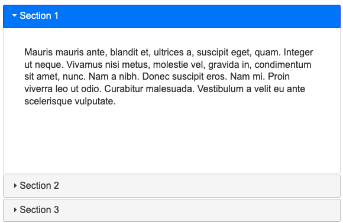
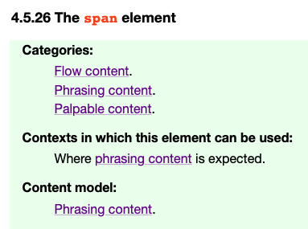
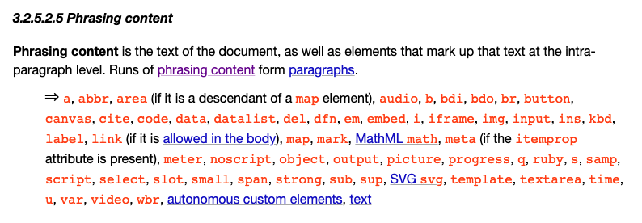

# 개요

프론트엔드 개발을 하다 보면 HTML, CSS 그리고 JavaScript 세 가지를 가장 많이 사용하게 됩니다. 세 가지 모두 중요하지만, 실질적인 비즈니스 로직이 JavaScript로 작성되고, 시각적인 부분은 CSS로 처리되기에 HTML은 뒷전인 경우가 많은데 종종 우선순위가 낮다 못해 아예 무시하고 개발을 하는 사람들도 보입니다. 실제로 저는 아래와 같은 생각을 가진 사람들을 꽤 많이 보았습니다.

- JavaScript가 제일 중요하지 않나요?
- HTML 코드 대충 작성해도 지금 화면에 원하는 대로 잘만 나오는데 왜 신경 쓰나요?
- 저는 프론트엔드 개발자가 되고 싶은데 HTML은 퍼블리셔가 하는 일 아닌가요? 
- `<div>` 쓰면 다 해결되지 않나요?

어떤 이유로든 위와 같은 생각을 가지고 있을수 있지만, HTML은 당신의 생각보다 더 중요합니다. 왜냐하면 더 많은 사람이 제대로 렌더링 보이는 웹 사이트를 볼 수 있게 하고 검색 엔진을 통해 유입될 수 있게 하며, 더 많은 사람이 웹 사이트를 사용할 수 있게 하기 때문입니다. HTML로 어떻게 그것들이 가능한지 몇 개의 예제를 통해 더 자세히 알아봅시다.


# 목적에 맞는 태그 사용하기

JavaScript처럼 HTML도 목적에 맞는 코드를 작성하는 것이 중요합니다. HTML5에 시맨틱 태그들이 도입되며 많은 분이 시맨틱 태그들을 사용하는데 과연 저희는 정말 태그들을 목적에 맞게 사용하고 있을까요? 간단한 예제들을 보면서 다시 한번 생각해봅시다.

## FAQ 목록

먼저, 어떤 웹 사이트의 자주 묻는 질문(FAQ) 목록을 만드는 경우를 가정해봅시다. 



이와 같은 컴포넌트를 코드로 표현하면 보통 아래와 같이 작성할 것입니다.

```html
<ul>
  <li>
    <div>
      <p>Section 1</p>
      <p>Lorem ipsum ...</p>
    </div>
  </li>
  <li>
    <div>
      <p>Section 2</p>
      ...
</ul>
```

하지만 이와 같이 작성하는 것이 정말 최선일까요? 조금 더 직관적인 구조로 작성할 수는 없을까요? 당연히 있습니다. 바로 `dl`, `dt`, `dd` 태그를 사용하면 됩니다. 처음 보시는 분들도 있겠지만 `dt`, `dd`는 Data Title과 Data Description의 약어로 제목과 값 쌍으로 이루어진 데이터를 표현할 때 사용하고 `dl`은 Data List로 `dt`, `dd`로 이루어진 데이터들의 목록을 표현할 때 사용합니다. 지금처럼 FAQ를 만들 때 아주 적합하죠.

앞에서 HTML5 시맨틱 태그를 이야기해놓고 뜬금없이 이 태그들을 언급하는 이유는, (목적에 더 맞기도 하지만) 사실 이 태그들은 [최초의 웹 페이지](http://info.cern.ch/hypertext/WWW/TheProject.html)에 사용된 태그들입니다. 굳이 HTML5가 아니더라도 기존의 태그들을 목적에 맞게 활용하면 직관적인 구조를 작성할 수 있다는 것이죠. 실제로 [HTML 사양 문서](https://html.spec.whatwg.org/multipage/grouping-content.html#the-dl-element)에 `dl` 태그의 사용 예제로 FAQ 리스트를 예를 들고 있습니다. 

`dl`, `dt`, `dd` 태그를 사용하여 위의 코드를 리팩토링하면 아래와 같습니다. 이제 어떤 태그가 어떤 값을 표현하는지 더 직관적이게 변했습니다. 이 예제를 통해 저희는 HTML5에 도입된 시맨틱 태그가 아니더라도 기존 태그를 목적에 맞게 잘 사용하면 직관적이게 표현할 수 있다는 것을 알았습니다.

```html
<dl>
  <div>
    <dt>Section 1</dt>
    <dd>Lorem ipsum ...</dd>
  </div>
  <div>
    <dt>Section 2</dt>
    <dd>...</dd>
  </div>
</dl>
```

## 링크와 버튼

종종 어떤 텍스트를 클릭하면 원하는 자바스크립트 함수를 실행시키는 등 임의의 동작이 수행되기를 원하는 경우가 있습니다. 이럴 때 아래와 같이 처리하는 것을 굉장히 많이 보았습니다.

```html
<a href="javascript:foobar()">누르면 무언가를 하는 텍스트</a>

<!-- 또는 -->

<a href="#;" onclick="javascript:foobar()">누르면 무언가를 하는 텍스트</a>
```

하지만 이처럼 처리하는 것은 `a` 태그의 잘못된 사용입니다. `a` 태그는 다른 문서를 가리키는 링크를 걸거나 링크가 들어갈 자리를 표시하는 placeholder 용도로 사용해야 합니다. 그렇다면 이런 경우는 어떻게 해야 할까요? 바로 `button`입니다. 클릭했을 때 임의의 동작을 수행하도록 설계된 요소죠. 그래서 아래와 같이 처리하는 것이 훨씬 더 목적에 맞는 태그 사용입니다.

아, 글자처럼 보이는 건 어떻게 하냐고요? CSS로 처리하면 됩니다!

```html
<button type="button" onclick="foobar()">누르면 무언가를 하는 텍스트</a>

<!-- 링크처럼 보이게 합니다. -->
<style>
button {
  padding: 0;
  border: 0;

  background: transparent;

  text-decoration: underline;

	appearance: none;
}
</style>
```

## 기타

그 외에도 제목에는 `p` 대신 `h1`을 사용하고, 영역을 분리 할때는 `div`만 사용하지 말고 `article`, `header`, `main`, `section` 등의 태그를 사용하면 훨씬 더 목적에 맞고 코드만 보아도 용도를 예측하기 쉬워집니다.

# 제대로 구조 정의하기

앞에서 목적에 맞는 태그를 살펴보았으니 이번에는 구조에 맞게 잘 정의하고 있는지 확인해봅시다. 과연, 아래의 HTML 코드는 잘 정의되어 있을까요? 잘 정의되지 않았다면 무엇이 문제일까요?

```html
<span>
  <p>Hello, World!</p>
</span>
```

문제가 무엇인지 알기 위해 [HTML 사양 문서](https://html.spec.whatwg.org/multipage/text-level-semantics.html#the-span-element)의 `span` 요소 부분을 확인해봅시다. 아래 이미지에 나온 내용 외에도 더 많은 내용이 있지만, 여기서는 Content model 부분을 확인해봅시다. Content model은 이 태그의 자식으로 어떤 것들이 들어갈 수 있는지를 나타냅니다. Phrasing content가 무엇인지 한번 확인해봅시다.



Phrasing content는 텍스트 조각이나 문단 수준의 텍스트를 나타내는 것이라고 합니다. 그리고 Phrasing content로 분류되는 태그들이 나열되어 있습니다. 하지만 저희가 위에서 사용했던 `p` 태그는 아무리 찾아봐도 없습니다.

네. `p` 태그는 `span` 태그의 자식으로 사용할 수 없습니다. 그래서 위의 코드는 구조적으로 잘못 짜였다는 것을 알 수 있습니다. HTML은 이런 문법적인 제약이 생각보다 굉장히 많습니다. 웹 브라우저는 잘못된 HTML을 파싱해도 명시적인 오류를 사용자에게 보여주지 않기 때문에 다들 잘 모르고 넘어가 버리지만요.



그런데, 이게 뭐가 중요할까요? 화면에 잘 나오기만 하면 되는 거 아닐까요? 아닙니다. 이런 잘못된 구조로 작성된 HTML은 크로스 브라우저 환경에서 일관된 화면을 렌더링 한다는 보장이 되지 않습니다. 또한 [검색 엔진 크롤러가 페이지를 색인](https://support.google.com/webmasters/answer/9679690)할 때 정상적으로 색인되지 않거나 느리게 색인되도록 만드는 원인이 됩니다. 그러니 올바른 구조로 작성된 페이지를 작성해야 잘 나온다는 것이 보장되며 검색 엔진에 빠르게 색인되어 방문자들이 유입되도록 만들 수 있습니다.

# 웹 접근성

웹은 이제 처음 만들어질때처럼 소수의 사람만이 사용하는 기술이 아닙니다. 전 세계의 수 많은 사람들이 사용하고 있고, 그 중에는 몸이 불편한 사람들도 있습니다. 그래서 몸이 불편한 사람들도 웹 서비스를 편하게 사용할 수 있도록하는 '웹 접근성'이 중요한데, 이를 간과하는 사람들이 많습니다.

가장 쉽게 접하는 예로 `img`의 `alt` 속성이 있는데, 시력이 아주 나쁘거나 혹은 시각장애를 가진 사용자들은 TTS로 웹 사이트를 읽어주는 스크린 리더를 사용하여 웹을 탐색합니다. 스크린 리더를 사용해 웹을 탐색하다가 이미지를 만났을때 스크린 리더는 이미지를 *어떻게* 읽어야 할까요? 바로 `alt` 속성의 값을 읽습니다. 아래와 같은 코드로 렌더링된 이미지가 있다면 'ACME'라고 스크린 리더가 읽어주죠.

```html
<!-- ACME 회사의 로고 이미지 -->

```

시각 장애 외에도 손을 움직이는데 제약이 있는 운동 장애가 있는 사용자들은 적은 움직임으로 웹을 탐색합니다. 보통 `Tab`키를 이용하여 웹 사이트의 콘텐츠들을 이동하며 원하는 버튼이나 링크 등을 선택합니다. 

만약 아래 같은 코드로 구성된 웹 페이지가 있을때, 사용자가 `Tab`키를 사용해서 어떤 요소들을 이동하며 선택할 수 있을까요? 바로 `button`만 선택할 수 있습니다. 분명히 `div`에는 `onclick` 이벤트가 할당되어 버튼과 비슷한 동작을 함에도 지금 웹 브라우저는 이 `div`를 포커싱 가능한 요소로 인식하지 않습니다.

```html
<button type="button" onclick="foobar()">어떤 버튼</button>
<div onclick="changeTheme()">다크 테마로 변경하기</div>
```

이런 경우에는 [웹 접근성 표준 WAI-ARIA](https://www.w3.org/WAI/standards-guidelines/aria/)를 따라 요소의 역할을 별도로 명시해주어야합니다. 이 경우에는 버튼처럼 사용하니 [role](https://developer.mozilla.org/en-US/docs/Web/Accessibility/ARIA/Roles) 속성을 사용하여 버튼처럼 동작한다고 알려주고, [tabindex](https://developer.mozilla.org/en-US/docs/Web/HTML/Global_attributes/tabindex) 속성을 사용하여 `Tab`키를 사용하여 요소를 선택할 수 있도록 하면 됩니다.

```html
<button type="button" onclick="foobar()">어떤 버튼</button>
<div onclick="changeTheme()" role="button" tabindex="0">다크 테마로 변경하기</div>
```

웹 접근성에는 위의 간단한 예제 외에도 저시력 시각 장애, 전맹 장애, 동작 장애 외에도 청각, 손 운동, 색맹 등 고려해야 할 사항이 정말 많습니다. 일이 더 많아진다고 느낄 수 있겠지만 웹 서비스를 만들때 접근성을 조금이라도 더 생각한다면 지금보다 더 사용하기 편한 웹 서비스들이 많아질 것 같습니다. 다수가 사용하는 웹 서비스도 좋지만 모두가 사용하는 웹 서비스는 더 좋으니까요. 웹 접근성에 더 자세히 알고 싶으시다면 아래의 링크를 참고해주세요.

- [W3C 웹 표준성 가이드라인](https://www.w3.org/WAI/standards-guidelines/aria/)
- [MDN 웹 접근성 문서](https://developer.mozilla.org/en-US/docs/Web/Accessibility)
- [네이버 널리](https://nuli.navercorp.com/)
- [네이버 웹 접근성 체험관](https://nax.naver.com/index)
- [유성두님 블로그](https://www.sungdoo.dev/)

# 마치며

목적에 맞는 태그 사용하기, 문법에 맞게 문서 구조화하기 그리고 웹 접근성 예제를 통해 HTML을 잘 사용하는 것이 생각보다 중요하다는 것을 알아보았습니다. 많은 사람들이 별로 신경쓰지 않는 HTML이지만 좋은 프론트엔드 개발자가 되기 위해서는 모두가 웹 서비스를 잘 사용할수 있도록하는 고민을 해야한다고 생각하고, 거기에 HTML이 많은 영향을 끼친다고 생각합니다. 아무쪼록 이 글이 사람들이 HTML을 통해 더 나은 웹 서비스를 만드는데 도움이 되었으면 좋겠습니다.